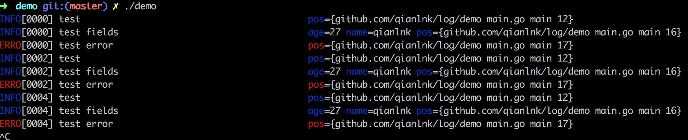

# log
    log format to logstash, it base on `github.com/Sirupsen/logrus`

# get start
### install
```
go get github.com/qianlnk/log
```

### use
```
import (
	"time"

	"github.com/qianlnk/log"
)

//run it like: nohub ./demo > a &
func main() {
	for {
		log.Info("test")
		log.Fields{
			"name": "qianlnk",
			"age":  "27",
		}.Info("test fields")
		log.Error("test error")
		time.Sleep(time.Second * 2)
	}
}
```

### result
```
tail -f a

time="2017-03-13T11:03:16+08:00" level=error msg="test error" pos={github.com/qianlnk/log/demo main.go main 17}
time="2017-03-13T11:03:18+08:00" level=info msg=test pos={github.com/qianlnk/log/demo main.go main 12}
time="2017-03-13T11:03:18+08:00" level=info msg="test fields" age=27 name=qianlnk pos={github.com/qianlnk/log/demo main.go main 16}
time="2017-03-13T11:03:18+08:00" level=error msg="test error" pos={github.com/qianlnk/log/demo main.go main 17}
time="2017-03-13T11:03:20+08:00" level=info msg=test pos={github.com/qianlnk/log/demo main.go main 12}
time="2017-03-13T11:03:20+08:00" level=info msg="test fields" age=27 name=qianlnk pos={github.com/qianlnk/log/demo main.go main 16}
time="2017-03-13T11:03:20+08:00" level=error msg="test error" pos={github.com/qianlnk/log/demo main.go main 17}
```

### debug
```
./demo
```

